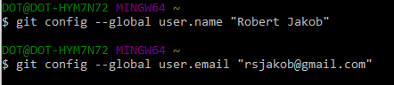

|[Return to TOC](00-Table-of-Contents.md)|
|---|

---

## Download Git

### Windows Install

To download the latest version of git for windows go to: [http://gitforwindows.org/](http://gitforwindows.org/)

Once the download has completed start the **Git Setup** and follow the prompts as shown below...


### Mac OS X Install
For the Mac, open a terminal (go to the search bar and type in terminal). Next
you need to install "Homebrew" - which simplifies the installation of software
on the Mac OS X operating system:
```
ruby -e "$(curl -fsSL https://raw.githubusercontent.com/Homebrew/install/master/install)"
brew doctor
```

You will be offered to install the Command Line Developer Tools from Apple. 
Confirm by clicking Install. After the installation finished, continue 
installing Homebrew by hitting return.

Once you've installed Homebrew Git is simple to install in the terminal by
typing:
```
brew install git
```

### Linux Install
For a Debian-based linux system, open a terminal and do the following:
```
sudo apt-get update
sudo apt-get upgrade
sudo apt-get install git
```

For a Red Hat-based linux system, open a terminal and do the following:
```
sudo yum update
sudo yum install git
```

## Once Git is installed
Run the following commands to configure your **Git username **and **email.** These details will be associated with any commits that you create:



Let's clone the Pegasus LMS repo using Git. Do the following in Git:
```
git clone https://github.com/ccoovrey/pegasus_lms.git
```

Now you have the repository on your laptop. With this repository you can start to use 
vagrant and look at different virtual machines.

To read tutorials you can either use your browser or for windows download:
[markdownpad](http://markdownpad.com/)

---

|---|
