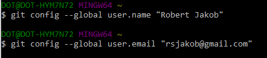

|[Return to TOC](00-Table-of-Contents.md)|
|---|

---

## Once Git is installed
Run the following commands to configure your **Git username **and **email.** These details will be associated with any commits that you create:




## Git Commands

```bash
# git clone a repository
git clone https://github.com/ccoovrey/some_repo.git

cd some_repo

# inspect the branches you have
git branch -v

# make your own branch locally - we are going to call this cadetbranch
git branch cadetbranch

# go to this branch (checkout)
git checkout cadetbranch

# go to directory where script is
cd some/directory/where/script_is

# lets say you are woking on a script named hsWinScript.ps1
# you can see what are new changes 
git status -s

# your done and want to push to the remote git repo
# first commit to your local repo
git add .
git commit -m "some comments on your dev"

# push to your remote repo
git push origin cadetbranch
```


---

|---|
